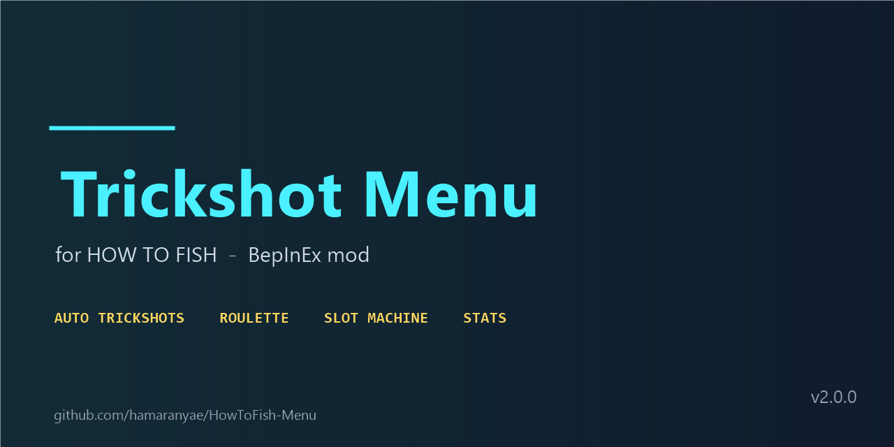

<p align="center">
  
</p>

<p align="center">
  <b>The all-in-one BepInEx mod menu for How to Fish.</b><br>
  Auto trickshots · Live roulette predictor · Casino cheats · Stat tracking
</p>

<p align="center">
  
  
  
  
  
</p>

**Trickshot Menu** is an in-game mod for **_How to Fish_** that automates the 360° trickshot system, chases every bonus multiplier, tracks your session, and adds casino cheats — a live roulette landing predictor, an always-win table, and a weapon-skin slot machine that spits out rare and legendary skins.

Want an "aimbot + casino helper" style training tool / cheat menu for How to Fish? This is it. Every feature is toggleable, fully rebindable, and explained by an in-game guide. Most options work in single player and co-op lobbies; the casino helpers are host-side only.

---

## ✨ Features

### 🎯 CONTROL — trickshot automation & tuning
| Option | What it does |
| --- | --- |
| **Auto Trickshot** | spins + fires at launched / free fish automatically, in range |
| **Airborne Only** | only untethered fish — never fires while reeling in or wound up close to the reel |
| **Jump For Aerial** | jumps before the shot for the *Aerial / Dogfight* bonus |
| **One-Shot Helper** | huge damage so fish dies in one round (*One Shot One Kill + Overkill*) |
| **Force Last Bullet** | loads exactly one round for the *Last Bullet* bonus |
| **Aim Heads** | headshot assist for the *Headshot* bonus |
| **Sliders** | spin speed, spin degrees, target lead, max range, combo window |
| **Direction / Weapons** | spin clockwise or counter-clockwise; PISTOL / SNIPER / SHOTGUN / ALL filter |
| **Spin Light FX / HUD** | cosmetic light-sweep + vignette, and the top-left status card |

### 💎 BONUS
See exactly which multipliers (Aerial, Headshot, Last Bullet, risk tiers) are lined up *before* you shoot.

### 📊 STATS
Trickshots fired, kills, best combo, best multiplier, estimated earnings, last chain — with session reset.

### 🎰 ROULETTE — predictor + always-win
- **Live landing predictor** — shows the exact color under the ball while the wheel still spins.
- **Always Win Roulette** — the table always pays your bet color: BLACK/RED **x2**, GREEN **x35**.

### 🎲 SLOT MACHINE — weapon skins
- **Free Spins** — auto-spins the skin machine beside you; nothing is deposited.
- **Force Rarity** — every spin lands a marked skin: 🔴 RED (rare-marked) or 🟡 GOLD (legendary-marked) — and unlocks it.

### 🛠 SETTINGS
- Rebind **every** hotkey (click a key, press the new one, ESC cancels).
- Animated **Mod Guide** overlay explaining each function.

### 📜 LOG
Live mod log window with a CLEAR button.

---

## 📥 Download

Grab the zip from the **[Releases](https://github.com/hamaranyae/HowToFish-Menu/releases)** page:

| Package | Contents |
| --- | --- |
| `HowToFish_TrickshotMenu_v2.0.0.zip` | the mod (`BepInEx\plugins\TrickshotMenu\TrickshotMenu.dll` + README + INSTALL guide) |
| `BepInEx_runtime_v6.0.0-be.788.zip` | BepInEx runtime — only if you don't have BepInEx installed yet |

---

## 🚀 Install

1. **BepInEx 6.0.0-be.788 (Unity Mono x64)** — extract the runtime zip (or grab it from the [BepInEx releases](https://github.com/BepInEx/BepInEx/releases)) into the folder containing `How to Fish.exe`.
2. **The mod** — extract the mod zip into the same folder and let it merge.

Your game folder should look like:

```
How to Fish.exe
winhttp.dll
doorstop_config.ini
BepInEx\
  core\...
  plugins\
    TrickshotMenu\
      TrickshotMenu.dll
```

3. Launch the game and press **F8** to open the menu.

Settings are saved to `BepInEx\config\trickshot.howtofish.cfg` on first launch.

---

## ⌨️ Keybinds (default)

| Key | Action |
| --- | --- |
| `F8` | open / close the menu |
| `F9` | manual trickshot right now |
| `F7` | open / close the log window |
| `F6` | dump full state to the log |

All rebindable in **SETTINGS → KEYBINDS**.

---

## 📝 Notes

- Casino cheats (**Always Win Roulette**, **Force Rarity**, **Free Spins**) are **host-side**: they work in single player and in your own co-op lobby — and everyone in the lobby sees the result.
- The roulette predictor reads the exact slot the ball sits on; the same value the server finalizes when the spin ends.
- The trickshot never fires while you are reeling in a fish.

---

## 🔧 Building from source

- Target framework: `netstandard2.1`
- Requires references to the game's managed assemblies (`Assembly-CSharp.dll`) and the BepInEx core assemblies.

```powershell
dotnet build -c Release
```

---

## 📄 License & legal

[MIT](LICENSE) — free to use, modify, and share. Unofficial fan project; not affiliated with the developers of _How to Fish_. Use at your own risk.